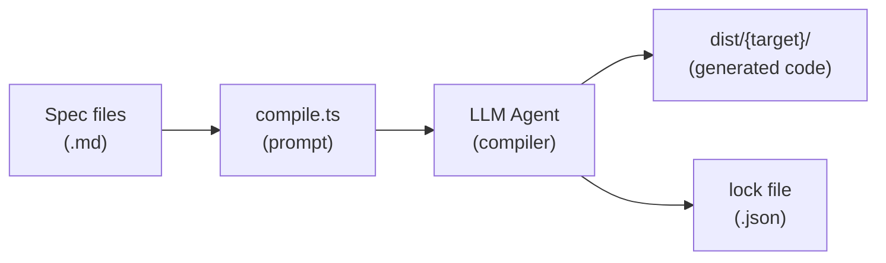

# TUIkit Specs

A spec-driven system for building UI components across programming languages.
Each component is defined as a language-agnostic markdown spec with behavioral
tests. An LLM agent acts as the "compiler" — reading specs and generating
idiomatic implementations per target framework.

## How it works



1. **Specs** define behavior + semantic tokens (like headless UI libraries)
2. **Target specs** define how to translate to a specific language/framework
3. **compile.ts** detects changed specs and generates a self-contained prompt
4. An **LLM agent** reads the prompt and generates idiomatic code
5. Generated code goes to **dist/** — specs stay clean
6. **Lock files** track which spec versions have been compiled

## Positioning

TUIkit applies the headless UI primitive model to terminal interfaces. Like
Radix Primitives and Base UI, it treats components as accessible, composable,
unstyled building blocks. Unlike web-first headless libraries, TUIkit keeps the
primitive contract in language-agnostic specs and uses an LLM agent as the
compiler backend to generate idiomatic implementations for each TUI framework.

This makes the markdown specs an intermediate representation: they capture
behavior, accessibility expectations, semantic tokens, tests, and previews,
while target specs define how those contracts map into Go/Bubbletea,
TypeScript/Ink, Bun/OpenTUI, Rust/Ratatui, or future terminal UI stacks.

## Quick start

### Prerequisites

- [Bun](https://bun.sh/) 1.1+ installed (`bun --version`)
- A [GitHub Copilot](https://github.com/features/copilot) subscription (for the `compile build` command)

### Install dependencies

```bash
bun install
```

### Common commands

```bash
# Lint all specs against the schema
bun run lint

# Check what needs compiling
bun run compile status

# Generate a prompt for a target
bun run compile prompt --target go

# The prompt is written to dist/go/_compile-prompt.md
# Feed it to an LLM agent (e.g. Copilot CLI, Claude, etc.)
# The agent writes generated code to dist/go/

# After verifying the generated code works, lock the hashes
bun run compile lock --target go
```

## Repository structure

```
TUIKit/
  components/       Component specs, tests, and preview definitions
  tokens/           Semantic design tokens (colors, icons, breakpoints)
  targets/          Target language/framework definitions
  docs/             Meta-schema and design foundations
  scripts/          Compiler and linter CLIs
  dist/             Compiled output per target (gitignored)
```

## Writing specs

### Component spec

Each component is a markdown file with YAML frontmatter and prose body:

````yaml
---
kind: component
name: MyComponent
description: One-line summary.
version: 1
category: input          # input | display | navigation | layout | feedback

tokens:
    colors: [textPrimary, selected]
    icons: [iconPrompt]

props:
    label:
        type: string
        required: true
        description: Display text.

dependencies:
    tokens:
        - name: textPrimary
          kind: color
          usage: "Label text"
          required: true
    components: []

accessibility:
    role: button
    announce:
        on_mount: "Button: {label}"
---

## Visual rules

- Label text MUST use the `textPrimary` color token
- Active state MUST use the `selected` color token

## Rendering example

Given label: "Click me"

​```
Click me
​```

## Dependencies

| Dependency | Kind | Usage | Required |
|------------|------|-------|----------|
| `textPrimary` | color | Label text | Yes |
| `selected` | color | Active state | Yes |
````

### Test spec

Test specs live alongside component specs and use a block-based format:

```markdown
---
kind: test
component: MyComponent
version: 1
---

## renders label text

​`props
label: "Hello"
​`

​`expect
Hello
​`
```

See `docs/schema.md` for the full format reference, including `input`, `state`,
`style`, and `accessibility` test blocks.

### Conformance language

All normative sections (Visual rules, Behavior, Edge cases) use
[RFC 2119](https://datatracker.ietf.org/doc/html/rfc2119) keywords:

- **MUST** — absolute requirement
- **SHOULD** — strong recommendation
- **MAY** — optional behavior
- **MUST NOT** — absolute prohibition

## Compiling to a target

### Available targets

| Target   | Language   | Framework              | File                |
| -------- | ---------- | ---------------------- | ------------------- |
| `go`     | Go         | Bubbletea + Lipgloss   | `targets/go.md`     |
| `node`   | TypeScript | Ink + React (Node.js)  | `targets/node.md`   |
| `bun`    | TypeScript | OpenTUI + React (Bun)  | `targets/bun.md`    |
| `rust`   | Rust       | Ratatui + Crossterm    | `targets/rust.md`   |

### Commands

| Command | Purpose |
| ------- | ------- |
| `compile status` | Show dirty/locked specs per target |
| `compile prompt` | Generate a compilation prompt file |
| `compile build` | Run an agent session to compile specs (requires Copilot) |
| `compile lock` | Lock spec hashes after verified compilation |
| `compile clean` | Remove lock file for a target |

### Build flags

```
bun run compile build --target <name> [flags]

Required:
  --target <name>     Target to compile (go, node, bun, rust)

Optional:
  --component <name>  Compile a single component/token only
  --out <dir>         Output directory (default: dist/<target>)
  --model <id>        Model to use (e.g. claude-sonnet-4, gpt-5)
  --effort <level>    Reasoning effort: low | medium | high | xhigh
  --verbose           Show full agent transcript (raw streaming)
  --no-lock           Prevent the agent from locking components
  --autopilot         Use SDK autopilot mode (agent runs fully autonomously)
  --all-targets       Compile all targets sequentially
```

### Workflow

```bash
# 1. See what's changed
bun run compile status

# 2. Compile interactively (prompts for model, effort, output dir)
bun run compile build --target bun

# 3. Or compile non-interactively with all options
bun run compile build --target bun --model claude-sonnet-4 --out dist/bun-claude

# 4. Or fire-and-forget with autopilot (SDK handles everything)
bun run compile build --target bun --model claude-sonnet-4 --autopilot
```

### Multi-pass compilation

The compiler supports two modes, controlled by the `--autopilot` flag:

**Interactive mode** (default): The SDK agent runs in `interactive` mode.
After the initial compilation pass, the compiler asks whether to continue with
another pass. Each pass sends an improvement prompt — the agent reviews, fixes,
and extends its own work. You see a boxed markdown summary after each pass.

**Autopilot mode** (`--autopilot`): Sets the SDK agent mode to `autopilot`.
The agent runs fully autonomously — it decides when to iterate, how many passes
to make, and when the work is complete. No user confirmation is needed.

| Pass | Focus | Typical outcome |
| ---- | ----- | --------------- |
| **1st** | Initial generation | Core tokens, first components fully wired into interactive demo. |
| **2nd** | Extend & fix | More components added, test failures fixed, demo polished. |
| **3rd** | Polish | Catches subtle spec violations, hardens edge cases. |

The agent is instructed to follow a **depth-over-breadth** philosophy: it fully
completes each component (implementation + tests + interactive demo) before
moving to the next one.

### Component locking

The agent locks components individually as it completes them by running:

```bash
bun run compile lock --target bun --component Select
```

This records the spec hash so the component won't be recompiled unless its spec
changes. You can also lock manually after verifying generated code:

```bash
# Lock a single component
bun run compile lock --target go --component Input

# Lock all specs for a target
bun run compile lock --target go

# Lock all targets
bun run compile lock --all-targets
```

### Custom output directory

By default, compiled code goes to `dist/<target>/`. Override with `--out`:

```bash
# Output to a custom directory
bun run compile build --target go --out dist/go-experimental

# The prompt and generated code go directly to dist/go-experimental/
```

### Generating prompts manually

If you prefer to feed the prompt to an external agent (Claude, ChatGPT, Copilot
Chat, etc.) instead of using `compile build`, use the `prompt` command:

```bash
# Generate a prompt for a target
bun run compile prompt --target go

# Generate for a single component
bun run compile prompt --target bun --component Select

# Generate to a custom directory
bun run compile prompt --target node --out ~/my-project
```

The prompt is written to `<out>/<target>/_compile-prompt.md` (e.g. `dist/go/_compile-prompt.md`). It contains:

- The target definition (framework, paradigm, file structure)
- An index of all dirty specs with file paths and summaries
- Instructions for the agent (depth-first, verification steps)
- Demo specification reference

> **Important:** Any coding session that uses this prompt should set its working
> directory to the repository root (where `components/`, `tokens/`, and `docs/`
> live). The prompt references spec files using paths relative to the repo root.

Feed this file to any LLM agent, then lock manually once verified:

```bash
# After the agent generates code and tests pass:
bun run compile lock --target go
```

### Adding a new target

1. Create `targets/{name}.md` following the target spec format in `docs/schema.md`
2. Define: architecture pattern, type mapping, callback translation, state
   machine pattern, token access, styling, composition, test pattern, key
   mapping, dependencies, and demo CLI
3. Run `bun run compile status` — your target will show up with all specs dirty
4. Run `bun run compile build --target {name}` to compile

## Linting

```bash
# Lint all specs
bun run lint

# Lint a single component
bun run lint --component Select

# Show fix suggestions
bun run lint --fix

# See all rules
bun run lint --help
```

The linter checks:

- Required frontmatter fields and valid values (zod schemas)
- Naming conventions (PascalCase components, camelCase props)
- RFC 2119 keyword usage in normative sections
- ARIA accessibility structure for interactive components
- Token cross-references resolve to known tokens
- Required body sections (Visual rules, Rendering example, Dependencies)
- Test specs reference existing components
- Broken internal markdown links

Rule definitions live in `scripts/lint-rules.ts` — edit that file to add or
change rules, severities, and fix hints.

## CI checks

The GitHub Actions workflow (`.github/workflows/specs-ci.yml`) runs on every PR:

1. **Spec lint** — `bun run lint`
2. **Compiler health** — `bun run compile status` for each target
3. **Prompt smoke test** — `bun run compile prompt` for each target
4. **No generated output committed** — ensures `dist/` is not tracked
5. **Changed-spec completeness** — if `{Name}.md` changes, matching `.test.md` and `.preview.md` must also change

## Design principles

- **Specs capture intent, not implementation** — ~95% behavioral intent vs.
  ~5% framework hints. This lets agents generate idiomatic code per framework
  rather than awkward transliterations.

- **Color tokens define meaning, not color values** — tokens like `textPrimary`
  and `selected` define UI roles. The color engine (Rampa, hardcoded hex,
  ANSI palette) is an implementation detail per target.

- **Layout is out of scope** — specs define behavior and semantic tokens.
  Spacing, padding, and spatial polish are per-target decisions (similar to
  headless UI libraries like Radix or Base UI).

- **Lock files enable incremental compilation** — only dirty specs trigger
  regeneration. Schema changes invalidate everything. Lock files are gitignored;
  a fresh clone starts with everything dirty.

For TUI design foundations — color systems, typography, iconography, layout
grids, accessibility patterns, keybinding conventions, and buffer management —
see [`docs/foundations.md`](docs/foundations.md).

## Bibliography

### Headless UI primitives

- [Radix Primitives](https://www.radix-ui.com/primitives/docs/overview/introduction)
  — low-level, accessible, unstyled React primitives for building design
  systems. TUIkit follows the same separation of behavior from presentation for
  terminal UI components.
- [Base UI](https://base-ui.com/) — unstyled, accessible React components from
  the creators of Radix, Floating UI, and Material UI. Its emphasis on
  composability, consistency, and no visual opinions mirrors TUIkit's
  spec-first primitive model.
- [WAI-ARIA Authoring Practices Guide](https://www.w3.org/WAI/ARIA/apg/) —
  reference patterns for accessible web widgets. TUIkit uses analogous
  accessibility contracts for terminal interactions, keyboard behavior, and
  announcements.
- [React Aria](https://react-spectrum.adobe.com/react-aria/) — accessibility
  primitives separated from styling. Useful precedent for defining interaction
  behavior independently from visual rendering.

### LLM compilers and specification-to-code systems

- [Language Models as Compilers: Simulating Pseudocode Execution Improves
  Algorithmic Reasoning in Language Models](https://arxiv.org/abs/2404.02575)
  — frames language models as systems that infer reusable task-level logic and
  execute it for specific instances. TUIkit similarly separates reusable specs
  from target-specific generation.
- [Requirements are All You Need: From Requirements to Code with
  LLMs](https://arxiv.org/html/2406.10101v1) — explores progressive prompting
  from requirements to tests and implementation. TUIkit's specs, tests, and
  compile prompts follow a similar structured requirements-to-code workflow.
- [Iterative Refinement of Project-Level Code Context for Precise Code
  Generation with Compiler Feedback](https://aclanthology.org/2024.findings-acl.138/)
  — introduces compiler/static-analysis feedback loops for improving generated
  code. TUIkit's lint, test, prompt, and lock workflow provides a similar
  verification loop for generated component implementations.
- [Combining LLM Code Generation with Formal Specifications and Reactive
  Program Synthesis](https://arxiv.org/abs/2410.19736) — combines LLM code
  generation with formal methods-based synthesis. This points toward stronger
  future conformance checks for TUIkit specs.
- [SpecifyUI: Supporting Iterative UI Design Intent Expression through
  Structured Specifications and Generative AI](https://arxiv.org/html/2509.07334v1)
  — introduces a structured UI intermediate representation for controllable
  generative design. TUIkit uses markdown specs as a terminal UI-oriented
  intermediate representation.
- [A2UI](https://a2ui.org/) — a declarative, framework-agnostic protocol for
  agent-generated UI surfaces. It is adjacent to TUIkit's goal of expressing UI
  intent once and rendering it across target environments.

## License

This project is licensed under the [MIT License](LICENSE).