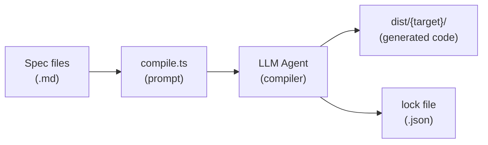

# TUIkit Specs

A spec-driven system for building UI components across programming languages.
Each component is defined as a language-agnostic markdown spec with behavioral
tests. An LLM agent acts as the "compiler" — reading specs and generating
idiomatic implementations per target framework.

## How it works



1. **Specs** define behavior + semantic tokens (like headless UI libraries)
2. **Target specs** define how to translate to a specific language/framework
3. **compile.ts** detects changed specs and generates a self-contained prompt
4. An **LLM agent** reads the prompt and generates idiomatic code
5. Generated code goes to **dist/** — specs stay clean
6. **Lock files** track which spec versions have been compiled

## Quick start

### Prerequisites

- [Bun](https://bun.sh/) 1.1+ installed (`bun --version`)

### Install dependencies

```bash
bun install
```

### Common commands

```bash
# Lint all specs against the schema
bun run lint

# Check what needs compiling
bun run compile status

# Generate a prompt for a target
bun run compile prompt --target go

# The prompt is written to dist/go/_compile-prompt.md
# Feed it to an LLM agent (e.g. Copilot CLI, Claude, etc.)
# The agent writes generated code to dist/go/

# After verifying the generated code works, lock the hashes
bun run compile lock --target go
```

## Repository structure

```
TUIKit/
  .github/
    workflows/
      specs-ci.yml          CI workflow (lint, compile health, prompt smoke test)
  components/
    {Name}/
      {Name}.md             Component spec
      {Name}.test.md        Behavioral test spec
      {Name}.preview.md     Preview/demo variants
    previews.md             Demo app spec (all components together)
  docs/
    schema.md               Meta-spec — defines the format for all spec types
  scripts/
    compile.ts              Compiler CLI (status, prompt, lock, clean)
    lint.ts                 Linter CLI
    lint-rules.ts           Lint rule definitions, zod schemas, and config
  targets/
    go.md                   Go + Bubbletea target definition
    bun.md                  Bun + Ink target definition
    rust.md                 Rust + Ratatui target definition
  tokens/
    colors.md               Semantic color tokens
    icons.md                Icon glyphs and semantic aliases
    breakpoints.md          Responsive width thresholds
  dist/                     Compiled output (gitignored)
  package.json              Dependencies and scripts
```

## Writing specs

### Component spec

Each component is a markdown file with YAML frontmatter and prose body:

````yaml
---
kind: component
name: MyComponent
description: One-line summary.
version: 1
category: input          # input | display | navigation | layout | feedback

tokens:
    colors: [textPrimary, selected]
    icons: [iconPrompt]

props:
    label:
        type: string
        required: true
        description: Display text.

dependencies:
    tokens:
        - name: textPrimary
          kind: color
          usage: "Label text"
          required: true
    components: []

accessibility:
    role: button
    announce:
        on_mount: "Button: {label}"
---

## Visual rules

- Label text MUST use the `textPrimary` color token
- Active state MUST use the `selected` color token

## Rendering example

Given label: "Click me"

​```
Click me
​```

## Dependencies

| Dependency | Kind | Usage | Required |
|------------|------|-------|----------|
| `textPrimary` | color | Label text | Yes |
| `selected` | color | Active state | Yes |
````

### Test spec

Test specs live alongside component specs and use a block-based format:

```markdown
---
kind: test
component: MyComponent
version: 1
---

## renders label text

​`props
label: "Hello"
​`

​`expect
Hello
​`
```

See `docs/schema.md` for the full format reference, including `input`, `state`,
`style`, and `accessibility` test blocks.

### Conformance language

All normative sections (Visual rules, Behavior, Edge cases) use
[RFC 2119](https://datatracker.ietf.org/doc/html/rfc2119) keywords:

- **MUST** — absolute requirement
- **SHOULD** — strong recommendation
- **MAY** — optional behavior
- **MUST NOT** — absolute prohibition

## Compiling to a target

### Available targets

| Target   | Language   | Framework              | File                |
| -------- | ---------- | ---------------------- | ------------------- |
| `go`     | Go         | Bubbletea + Lipgloss   | `targets/go.md`     |
| `node`   | TypeScript | Ink + React (Node.js)  | `targets/node.md`   |
| `bun`    | TypeScript | OpenTUI + React (Bun)  | `targets/bun.md`    |
| `rust`   | Rust       | Ratatui + Crossterm    | `targets/rust.md`   |

### Workflow

```bash
# 1. See what's changed
bun run compile status

# 2. Generate the compilation prompt
bun run compile prompt --target go

# 3. Feed dist/go/_compile-prompt.md to an LLM agent
#    The agent generates code into dist/go/

# 4. Verify: run tests, check the demo CLI
cd dist/go && go test ./... && go run ./cmd/demo

# 5. Lock the hashes
bun run compile lock --target go
```

### Multi-pass compilation

A single compilation pass across the full component suite (17 components +
tokens + demo) is usually not enough to reach production quality. We've found
that **2–3 passes** produce notably better results:

| Pass | Focus | Typical outcome |
| ---- | ----- | --------------- |
| **1st** | Initial generation | All components scaffold correctly, most tests pass, demo wires up. Expect rough edges — missing edge cases, incomplete keybindings, demo wiring bugs. |
| **2nd** | Review & fix | Agent reviews its own output against specs, fixes test failures, fills in missing behavior, improves demo interactivity. Test count typically grows 30–50%. |
| **3rd** | Polish | Catches subtle spec violations, improves accessibility, hardens demo `--snapshot` smoke tests. Diminishing returns after this point. |

To run a follow-up pass, generate a new prompt and tell the agent to review
and complete its existing work:

```bash
# Generate a fresh prompt (it sees the current dist/ state)
bun run compile prompt --target go

# Feed to the agent with instructions like:
# "Review your existing implementation against the specs.
#  Fix any test failures, fill in missing behavior,
#  and ensure all --snapshot smoke tests pass."
```

Each pass is fast because the agent builds on its own prior output rather than
starting from scratch. The demo's `--list` and `--snapshot` flags make it easy
for the agent to self-verify between passes.

### Custom output directory

By default, compiled code goes to `dist/`. Override with `--out`:

```bash
# Output to a separate repo or directory
bun run compile prompt --target go --out ~/my-tuikit-go

# The prompt and generated code go to ~/my-tuikit-go/go/
```

### Adding a new target

1. Create `targets/{name}.md` following the target spec format in `docs/schema.md`
2. Define: architecture pattern, type mapping, callback translation, state
   machine pattern, token access, styling, composition, test pattern, key
   mapping, dependencies, and demo CLI
3. Run `bun run compile status` — your target will show up with all specs dirty
4. Run `bun run compile prompt --target {name}` and compile

## Building your own component library

The specs are designed to bootstrap a full component library in your target
language. Use `--out` to point at your own project and maintain it independently.

### Initial compilation

```bash
# 1. Create your project directory
mkdir ~/my-tuikit-go && cd ~/my-tuikit-go
go mod init github.com/myorg/tuikit

# 2. Generate the full compilation prompt
bun run compile prompt --target go --out ~/my-tuikit-go

# 3. Feed the prompt to an LLM agent
#    Point the agent at ~/my-tuikit-go/go/_compile-prompt.md
#    It generates all components, tokens, and tests into ~/my-tuikit-go/go/

# 4. Verify everything works
cd ~/my-tuikit-go/go && go test ./...

# 5. Lock the compiled state
bun run compile lock --target go
```

Your component library now lives in `~/my-tuikit-go/` — a standalone project
you own, version, and publish independently of the specs.

### Incremental updates

When specs change (new components, bug fixes, behavior changes), you don't
need to recompile everything:

```bash
# See what changed since last compilation
bun run compile status --target go

# Generate a prompt with only dirty specs
bun run compile prompt --target go --out ~/my-tuikit-go

# The prompt tells the agent exactly which components to update
# Feed it to the agent — it patches your existing codebase

# Verify and lock
cd ~/my-tuikit-go/go && go test ./...
bun run compile lock --target go
```

### Extending with custom components

You can add components to the specs and compile them into your library:

1. Create `components/MyComponent/MyComponent.md` following the format
2. Create `components/MyComponent/MyComponent.test.md` with behavioral tests
3. Run `bun run lint` to validate against the schema
4. Run `bun run compile prompt --target go --out ~/my-tuikit-go`
5. The new component appears in the prompt alongside any other dirty specs

### Multiple targets from one spec set

The same specs can produce libraries for different languages simultaneously:

```bash
# Compile to all your targets
bun run compile prompt --target go --out ~/tuikit-go
bun run compile prompt --target rust --out ~/tuikit-rust

# Each output is a standalone project with idiomatic code
# Lock each target independently
bun run compile lock --target go
bun run compile lock --target rust
```

## Linting

```bash
# Lint all specs
bun run lint

# Lint a single component
bun run lint --component Select

# Show fix suggestions
bun run lint --fix

# See all rules
bun run lint --help
```

The linter checks:

- Required frontmatter fields and valid values (zod schemas)
- Naming conventions (PascalCase components, camelCase props)
- RFC 2119 keyword usage in normative sections
- ARIA accessibility structure for interactive components
- Token cross-references resolve to known tokens
- Required body sections (Visual rules, Rendering example, Dependencies)
- Test specs reference existing components
- Broken internal markdown links

Rule definitions live in `scripts/lint-rules.ts` — edit that file to add or
change rules, severities, and fix hints.

## CI checks

The GitHub Actions workflow (`.github/workflows/specs-ci.yml`) runs on every PR:

1. **Spec lint** — `bun run lint`
2. **Compiler health** — `bun run compile status` for each target
3. **Prompt smoke test** — `bun run compile prompt` for each target
4. **No generated output committed** — ensures `dist/` is not tracked
5. **Changed-spec completeness** — if `{Name}.md` changes, matching `.test.md` and `.preview.md` must also change

## Design principles

- **Specs capture intent, not implementation** — ~95% behavioral intent vs.
  ~5% framework hints. This lets agents generate idiomatic code per framework
  rather than awkward transliterations.

- **Color tokens define meaning, not color values** — tokens like `textPrimary`
  and `selected` define UI roles. The color engine (Rampa, hardcoded hex,
  ANSI palette) is an implementation detail per target.

- **Layout is out of scope** — specs define behavior and semantic tokens.
  Spacing, padding, and spatial polish are per-target decisions (similar to
  headless UI libraries like Radix or Base UI).

- **Lock files enable incremental compilation** — only dirty specs trigger
  regeneration. Schema changes invalidate everything. Lock files are gitignored;
  a fresh clone starts with everything dirty.
